# 🏗️ System Architecture - Clinical Copilot

This document provides a comprehensive overview of the Clinical Copilot system architecture.

---

## High-Level Architecture

```mermaid
graph TB
    subgraph Frontend["🖥️ Frontend (Next.js)"]
        UI[X-Terminal Dashboard]
        TM[Telemetry Module]
        RG[Risk Gauges]
    end
    
    subgraph Backend["⚙️ Go Backend (Fiber)"]
        API[REST API Router]
        CACHE[Diagnosis Cache]
        RAG[RAG-Lite Engine]
        MED[Medication Checker]
    end
    
    subgraph ML["🧠 ML API (FastAPI)"]
        PRED[Prediction Engine]
        MODELS[Model Registry]
        LLM[Gemini LLM]
    end
    
    subgraph Data["💾 Data Layer"]
        DB[(SQLite DB)]
        PKL[Model Files .pkl]
    end
    
    UI --> API
    API --> PRED
    API --> DB
    RAG --> DB
    PRED --> MODELS
    MODELS --> PKL
    PRED --> LLM
```



---

## Component Details

### 1. Frontend Layer (Next.js 14)

**Location:** `/frontend/`

| Component | Purpose |
|-----------|---------|
| **X-Terminal Dashboard** | Bloomberg-style high-density UI |
| **Telemetry Panel** | Real-time vital signs display |
| **Risk Gauges** | Visual risk indicators (0-100%) |
| **Neural Differential Panel** | LLM diagnosis display |
| **Medication HUD** | Drug interaction warnings |
| **Patient Queue** | Sidebar patient list |

**Key Technologies:**
- **Framework:** Next.js 14 with App Router
- **Styling:** Tailwind CSS
- **Animations:** Framer Motion
- **Icons:** Lucide React
- **State:** React useState/useEffect

**Port:** 3001 (development)

---

### 2. Backend Orchestrator (Go Fiber)

**Location:** `/backend/main.go`

The Go backend serves as the system orchestrator, handling:


**Key Features:**

1. **Patient Persistence**
   - Uses GORM ORM with SQLite
   - Auto-migration on startup
   - Demo data seeding

2. **RAG-Lite Implementation**
   - Fetches last 3 approved doctor feedbacks
   - Injects context into LLM prompts
   - Enables continuous learning from clinicians

3. **Async Diagnosis Pattern**
   - Non-blocking LLM calls
   - In-memory cache for results
   - Frontend polling support

4. **Medication Safety**
   - Comma-separated medication parsing
   - Pattern matching against known conflicts

**Port:** 3000

---

### 3. ML Intelligence Layer (Python FastAPI)

**Location:** `/src/api/ml_api/main.py`


**ML Models:**

| Model | Algorithm | Features | Training Data |
|-------|-----------|----------|---------------|
| Heart | XGBoost | 13 | Cleveland Clinic |
| Diabetes | XGBoost | 22 | BRFSS 2015 |
| Stroke | XGBoost | 10 | Kaggle Stroke |
| Kidney | Random Forest | 24 | UCI CKD |

**LLM Integration:**
- Google Gemini Flash (gemini-flash-latest)
- Async generation
- Fallback mock responses for offline development

**Port:** 8000

---

### 4. Data Layer

#### SQLite Database

**Location:** `/backend/clinical.db`

**Tables:**

```sql
-- Patient Records
CREATE TABLE patient_data (
    id INTEGER PRIMARY KEY,
    created_at DATETIME,
    age INTEGER,
    gender TEXT,
    systolic_bp INTEGER,
    diastolic_bp INTEGER,
    glucose INTEGER,
    bmi REAL,
    cholesterol INTEGER,
    heart_rate INTEGER,
    steps INTEGER,
    smoking TEXT,
    alcohol TEXT,
    medications TEXT
);

-- Doctor Feedback (RAG-Lite)
CREATE TABLE feedbacks (
    id INTEGER PRIMARY KEY,
    created_at DATETIME,
    assessment_id TEXT,
    doctor_approved BOOLEAN,
    doctor_notes TEXT,
    risk_profile TEXT  -- JSON
);
```

#### Model Files

**Location:** `/models/`

| File | Size | Format |
|------|------|--------|
| `heart_model.pkl` | 140 KB | joblib |
| `diabetes_model.pkl` | 437 KB | joblib |
| `stroke_model.pkl` | 259 KB | joblib |
| `kidney_model.pkl` | 195 KB | joblib |
| `model_metadata.json` | 2 KB | JSON |

---

## Data Flow

### Patient Assessment Flow


### Emergency Detection

```mermaid
graph TD
    A[Patient Data] --> B{Heart Risk > 85%?}
    B -->|Yes| E[🚨 EMERGENCY]
    B -->|No| C{Systolic BP > 180?}
    C -->|Yes| E
    C -->|No| D[Normal Flow]
```



---

## Deployment Architecture

### Development Setup

```
┌─────────────────────────────────────────────────────────────┐
│                    Developer Machine                         │
├─────────────────────────────────────────────────────────────┤
│  ┌─────────────┐  ┌─────────────┐  ┌─────────────────────┐  │
│  │  Frontend   │  │  Go Backend │  │    Python ML API    │  │
│  │  :3001      │──│  :3000      │──│    :8000            │  │
│  │  Next.js    │  │  Fiber      │  │    FastAPI          │  │
│  └─────────────┘  └──────┬──────┘  └──────────┬──────────┘  │
│                          │                     │             │
│                   ┌──────┴──────┐       ┌──────┴──────┐     │
│                   │ clinical.db │       │ models/*.pkl│     │
│                   │   SQLite    │       │   joblib    │     │
│                   └─────────────┘       └─────────────┘     │
└─────────────────────────────────────────────────────────────┘
                          │
                          ▼
            ┌─────────────────────────┐
            │   Google Gemini API     │
            │   (External Service)    │
            └─────────────────────────┘
```

### Startup Commands

```bash
# Terminal 1: Python ML API
cd Healthcare\ System
source venv/bin/activate
uvicorn src.api.ml_api.main:app --port 8000

# Terminal 2: Go Backend
cd backend
go run main.go

# Terminal 3: Frontend
cd frontend
npm run dev -- -p 3001
```

---

## Security Considerations

### Current Implementation (Hackathon Scope)

| Concern | Status | Notes |
|---------|--------|-------|
| Authentication | ⚠️ None | Demo mode - no auth required |
| HTTPS | ❌ | Development only (HTTP) |
| Input Validation | ✅ Pydantic | Request body validation |
| SQL Injection | ✅ GORM | ORM parameterized queries |
| API Keys | ✅ Env Vars | GEMINI_API_KEY in .env |

### Production Recommendations

1. **Add JWT Authentication** to Go backend
2. **Enable HTTPS** with TLS certificates
3. **Rate Limiting** on ML API endpoints
4. **Audit Logging** for all patient data access
5. **HIPAA Compliance** review before clinical use

---

## Performance Characteristics

### Latency Breakdown

| Operation | Typical Latency |
|-----------|-----------------|
| DB Write (Patient) | ~5ms |
| RAG Query (3 feedbacks) | ~10ms |
| ML Predict (4 models) | ~50-100ms |
| LLM Diagnosis | ~2-5 seconds |
| **Total (without LLM)** | **~100ms** |

### Async Optimization

The system returns immediately after ML prediction (~100ms) while the LLM diagnosis runs in the background. The frontend polls for the diagnosis result.

---

## Scalability Path

### Horizontal Scaling


### Recommended Upgrades

1. **Database:** Migrate SQLite → PostgreSQL for multi-instance
2. **Caching:** Add Redis for diagnosis cache
3. **Queue:** Use RabbitMQ for async LLM jobs
4. **ML Serving:** Deploy models with TensorFlow Serving or Triton

---

*Last updated: December 26, 2025*
