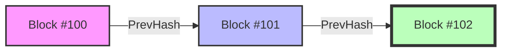
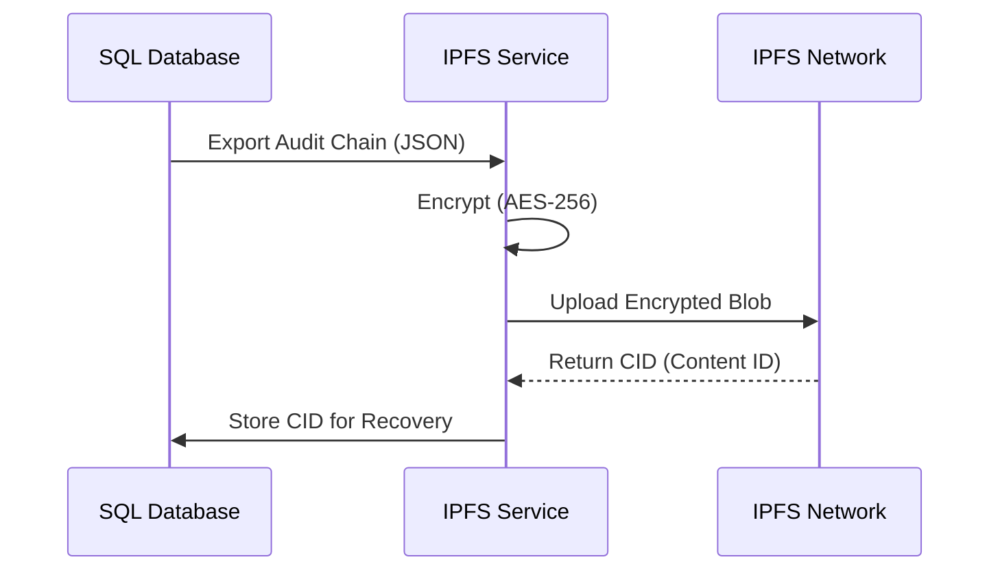

# ⛓️ Blockchain Trust Layer: Technical White Paper

## 1. Executive Summary
The **Healthcare Global Trust Layer** is a purpose-built, immutable ledger designed to bring **transparency, non-repudiation, and auditability** to medical AI decisions. Unlike generic blockchains (e.g., Ethereum), this system is optimized for **clinical throughput** and **EU AI Act Compliance** (specifically Article 15).

It answers the critical question: *"Who watches the AI?"*

---

## 2. Core Architecture

### 2.1 The Immutable Chain (Merkle-Like Structure)
The core of the system is a linked list of cryptographic blocks. Each block carries a "fingerprint" (hash) of the previous block.



*   **Genesis Block:** The anchor of trust.
*   **Tamper Evidence:** If a malicious actor modifies data in `Block #100`, its hash changes. Consequently, `Block #101`'s link breaks. The entire chain becomes mathematically invalid from that point forward.

### 2.2 Data Structure (The "Block")
Every critical event (AI Prediction, Doctor Approval) is recorded as a standard Go struct:

```go
type AuditLog struct {
    ID             uint      // Sequence Number
    Timestamp      time.Time // UTC Timestamp
    EventType      string    // e.g., "AI_PREDICTION"
    PayloadHash    string    // SHA-256(Data)
    PrevHash       string    // Link to previous block
    CurrentHash    string    // SHA-256(Timestamp + Payload + PrevHash)
    ActorID        string    // "Dr. Smith" or "System_Oracle"
    ActorSignature string    // Ed25519 Cryptographic Signature
}
```

---

## 3. Cryptographic Proof (The "Signature")

To prevent identity spoofing (e.g., "The AI made me do it"), we implement **Ed25519 Digital Signatures**.

### 3.1 Why Ed25519?
*   **Performance:** High-speed signing/verification (essential for real-time ER usage).
*   **Security:** High resistance to side-channel attacks.
*   **Standard:** Modern industry standard (used in TLS 1.3, SSH).

### 3.2 The Signing Process
1.  **Event Generation:** A doctor clicks "Approve".
2.  **Hashing:** The payload is hashed (SHA-256).
3.  **Signing:** The system signs `(PayloadHash + Timestamp)` using the actor's Private Key.
4.  **Verification:** Any auditor can use the Public Key to cryptographically prove that **only** that specific actor could have approved the action.

---

## 4. Compliance Mapping (EU AI Act)

| EU AI Act Requirement | Technical Implementation |
| :--- | :--- |
| **Article 13 (Transparency)** | **Model Identity Cards** recorded on-chain verify which model version was used. |
| **Article 14 (Human Oversight)** | **Human Override Logs** are signed events. If a doctor overrules AI, it's immutable proof of human agency. |
| **Article 15 (Accuracy & Cybersecurity)** | **The Chain Itself.** Prevents retroactive data tampering ("Log whitening"). |
| **Annex III (High-Risk Systems)** | **Full Traceability.** From patient intake to final diagnosis, every step is linked. |

---

## 5. Resilience & Disaster Recovery

We employ a **Hybrid Cloud/Decentralized** strategy for data survival.

### 5.1 The Strategy
1.  **Hot Storage:** High-performance SQL database (SQLite/Postgres) for milisecond-latency queries.
2.  **Cold Storage (The "Bunker"):** IPFS (InterPlanetary File System).

### 5.2 IPFS Backup Workflow
Even if our central servers are destroyed (fire, ransomware), the audit trail survives.



*   **Encryption:** All data is encrypted with AES-256 before leaving our premise.
*   **Decentralization:** The data is sharded and stored across the global IPFS network (Simulation for Hackathon Demo).

---

## 6. Conclusion for Jury

This architecture transforms the project from a "useful tool" to a **"liable entity"**. We don't just "predict" heart attacks; we **mathematically guarantee the integrity of the medical decision process**.
