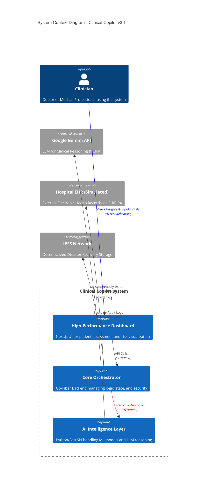
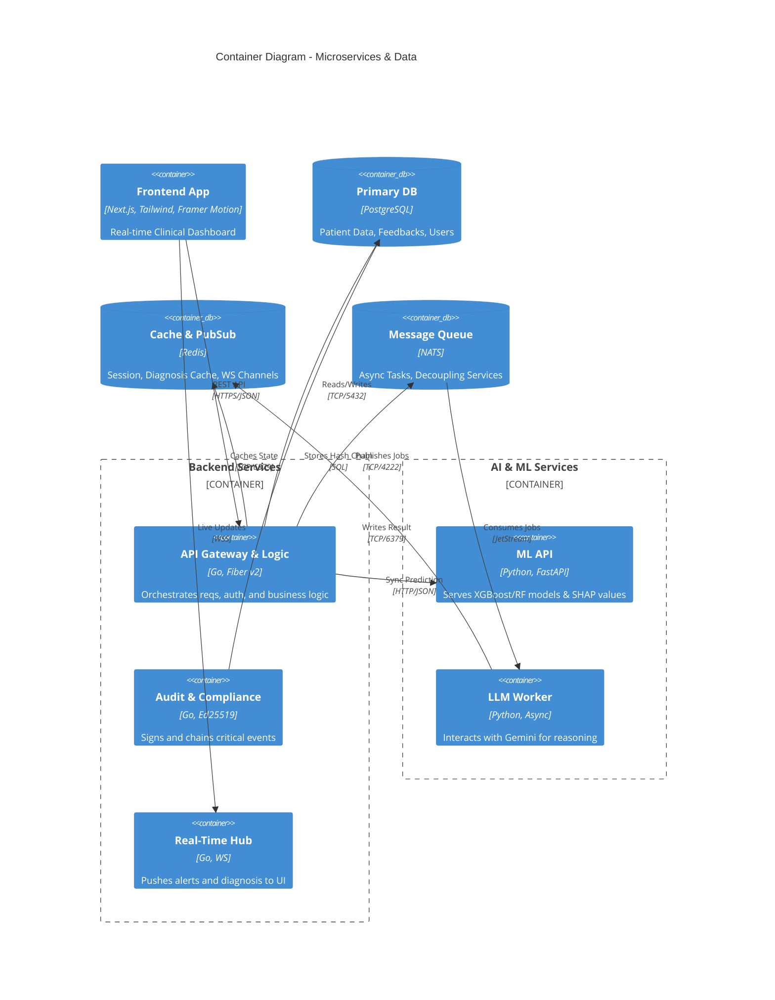
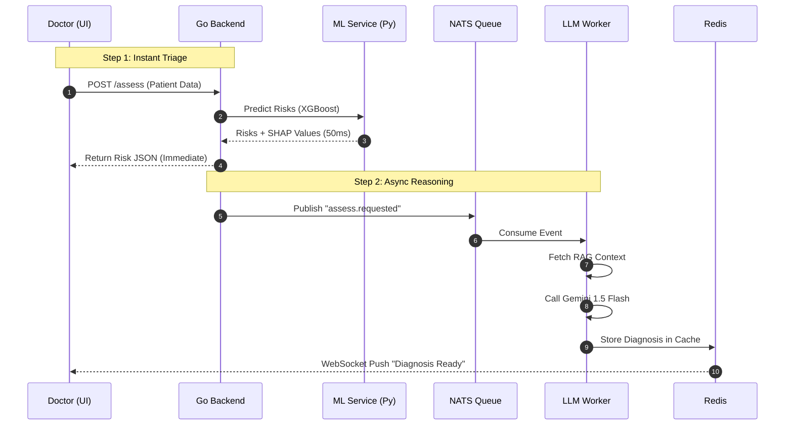
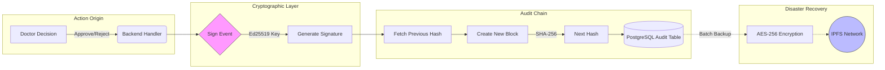
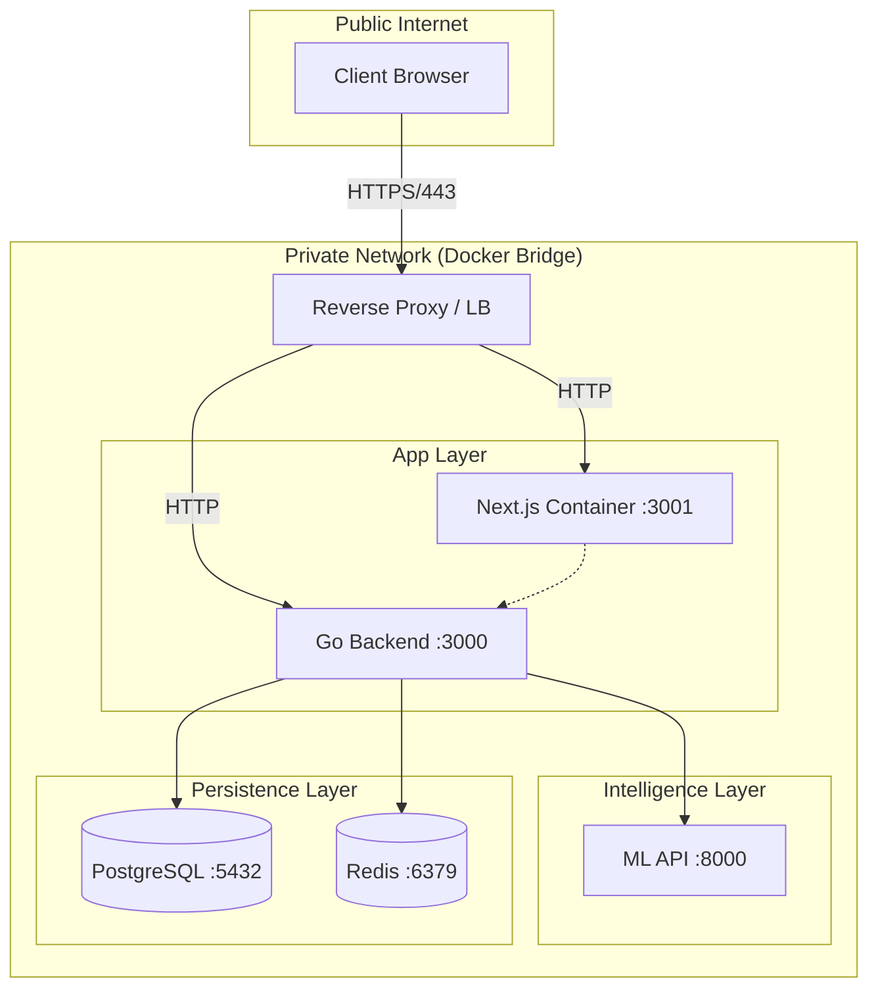

# 🔍 System Architecture Visualization

This document visualizes the **Clinical Copilot v3.1** technical architecture, illustrating how the Next.js Frontend, Go Backend, Python ML Engine, and Compliance Services interact.

---

## 1. System Landscape (High-Level)

The high-level view of how Clinical Copilot integrates with the healthcare ecosystem.

---

## 2. Container Architecture (Detailed Tech Stack)

A deep dive into the deployed containers, protocols, and data stores.

---

## 3. Critical Process Flows

### A. The "Zero-Block" Diagnosis Pipeline

How the system delivers instant risk scores while processing complex reasoning in the background.

### B. EU AI Act - Audit & Integrity Flow

How we ensure non-repudiation and tamper-proof logging.

---

## 4. Network & Security Topology

Physical deployment view (Docker Compose / Cloud).

